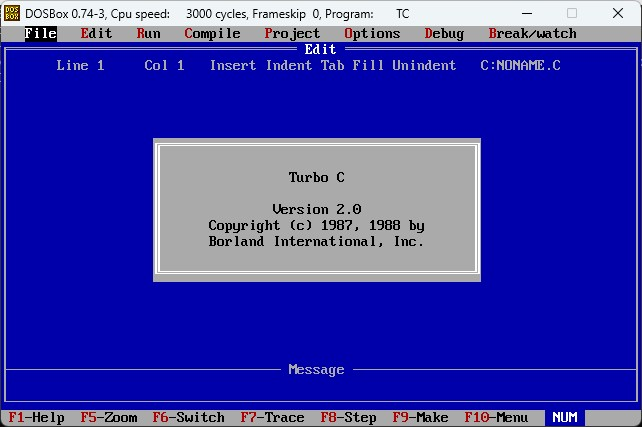
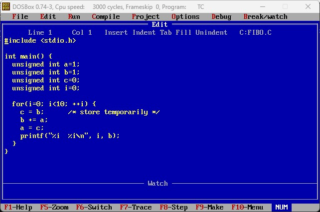

# MS-DOS Turbo C Development Environment

Development environment using Borland's Turbo C compiler.

## Usage

Install [DOSBox](https://www.dosbox.com/) and mount the `ROOT` folder as your C-drive.

## Sources

* [Norton Commander images](https://winworldpc.com/product/norton-commander/5x)
* [Borland Turbo C images](https://winworldpc.com/product/borland-turbo-c/2x)